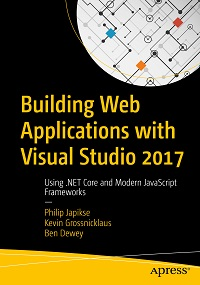

# Apress Source Code

This repository accompanies [*Building Web Applications with Visual Studio 2017*](https://www.apress.com/9781484224779) by Philip Japikse, Kevin Grossnicklaus, and Ben Dewey (Apress, 2017).

[comment]: #cover

Download the files as a zip using the green button, or clone the repository to your machine using Git.

## Releases

Release v1.0 corresponds to the code in the published book, without corrections or updates.

Release v1.1 All code has been retested and runs with the latest 1.1x frameworks (currently 1.1.7) as of May 7, 2018. Please note that this book was written for .NET 1.1.x.

## Contributions

See the file Contributing.md for more information on how you can contribute to this repository.